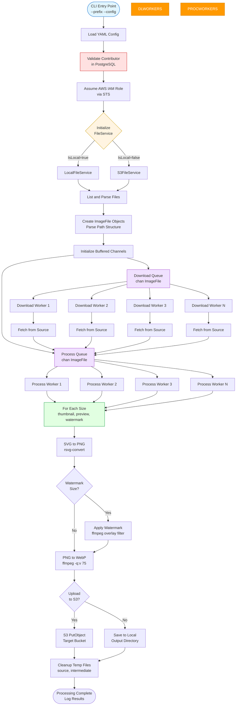

# Architecture Overview

## Table of Contents
- [Introduction](#introduction)
- [System Architecture](#system-architecture)
- [Core Components](#core-components)
- [Data Flow](#data-flow)
- [Concurrency Model](#concurrency-model)
- [Design Patterns](#design-patterns)
- [Technology Stack](#technology-stack)
- [Performance Characteristics](#performance-characteristics)

---

## Introduction

This high-performance CLI application is designed to batch-process hundreds of thousands of SVG images, converting them to optimized WebP format at multiple sizes. Built for [Vectopus.com](https://vectopus.com), it demonstrates enterprise-grade Go development with a focus on concurrency, modularity, and performance.

### Key Highlights
- **Performance**: 16x faster than single-threaded execution, processing 500K files in ~45 minutes
- **Scalability**: Configurable worker pools for download and processing operations
- **Flexibility**: Supports both local filesystem and AWS S3 storage backends
- **Production-Ready**: Database validation, comprehensive logging, error handling, and cleanup

---

## System Architecture

The application follows a **producer-consumer pattern** with **dual worker pools**, using Go's concurrency primitives (goroutines, channels, and WaitGroups) to achieve high throughput.

### Architecture Diagram



---

## Core Components

### 1. **ImageProcessor**
The main orchestrator that manages the entire processing lifecycle.

**Responsibilities:**
- Configuration management
- AWS session management (IAM role assumption)
- Worker pool coordination
- Logging setup
- Cleanup operations

**Key Fields:**
```go
type ImageProcessor struct {
    UUID          string                   // Unique run identifier
    Contributor   string                   // Vendor/contributor name
    Config        *Config                  // YAML configuration
    Session       *session.Session         // AWS session
    DownloadQueue chan imagefile.ImageFile // Buffered channel for downloads
    ProcessQueue  chan imagefile.ImageFile // Buffered channel for processing
    FileService   fileservice.IFileService // Storage abstraction
}
```

**Location:** `src/image-processor/main.go:28`

---

### 2. **FileService (Strategy Pattern)**
Abstract file operations to support multiple storage backends.

**Interface:**
```go
type IFileService interface {
    Transfer(input TransferInput) error
    ListFiles(input ListFilesInput, callback func(*string) bool) ([]string, error)
    Download(file *imagefile.ImageFile, dest string) (string, error)
    ToImageFiles(files []string) ([]*imagefile.ImageFile, error)
}
```

**Implementations:**
- **LocalFileService:** Direct filesystem operations
- **S3FileService:** AWS SDK-based S3 operations

**Location:** `src/file-service/IFileService.go:7`

---

### 3. **ImageFile**
Represents a parsed image file with metadata extracted from its path structure.

**Path Structure:**
```
{contributor}/{type}/{familyUUID}/{setUUID}/{filename}.{ext}
Example: iconify/icons/2C5AC6FCEB8D/6591D6BE211A/coffee-cup.svg
```

**Key Fields:**
```go
type ImageFile struct {
    URL               string   // Original path/URL
    ObjectKey         string   // Normalized S3 key or relative path
    Contributor       string   // Vendor name
    ProductType       *string  // "icons" or "illustrations"
    FamilyUniqueID    string   // 12-char UUID
    SetUniqueID       *string  // 12-char UUID (optional)
    Filename          string   // Base filename
    Extension         string   // File extension
    Slug              string   // URL-safe name
    Stem              string   // Filename without size suffix
    OptimizedImageKey string   // Target WebP key
}
```

**Location:** `src/image-file/main.go:12`

---

### 4. **DatabaseService**
Validates contributors against a PostgreSQL database using GORM.

**Purpose:**
- Ensures only authorized contributors are processed
- Prevents processing of invalid or unauthorized vendor data

**Location:** `src/database/IDatabaseService.go:5`

---

### 5. **Config**
YAML-based configuration with sensible defaults.

**Key Settings:**
- AWS region, buckets, and role ARN
- Worker pool sizes (download and process)
- WebP output sizes (thumbnail, preview, watermark)
- Local paths and cleanup settings
- Hardware acceleration flags

**Location:** `src/image-processor/config.go:11`

---

## Data Flow

### Phase 1: Initialization
1. Parse CLI flags (`--prefix`, `--config`)
2. Load YAML configuration
3. Validate contributor exists in database
4. Assume AWS IAM role via STS
5. Initialize appropriate FileService (Local or S3)

### Phase 2: File Discovery
1. List all files from source (local directory or S3 bucket)
2. Parse each path into an `ImageFile` struct
3. Filter based on include/exclude prefixes
4. Skip hidden files and invalid paths

### Phase 3: Concurrent Download
1. Fill `DownloadQueue` with `ImageFile` objects
2. Spawn N download workers (configurable)
3. Each worker:
   - Pulls file from source (S3 or local)
   - Saves to working directory: `{workDir}/{uuid}/source/{objectKey}`
   - Pushes to `ProcessQueue`

### Phase 4: Concurrent Processing
1. Spawn M processing workers (configurable)
2. Each worker pulls from `ProcessQueue` and:
   - Creates temp directories: `source/`, `intermediate/`, `output/`
   - For each configured size (e.g., 128px, 512px):
     - Converts SVG → PNG using `rsvg-convert` (`funcs.go:24`)
     - Applies watermark (if needed) using `ffmpeg` overlay filter (`funcs.go:73`)
     - Converts PNG → WebP using `ffmpeg` with quality setting (`funcs.go:41`)
     - Uploads to S3 or saves locally

### Phase 5: Cleanup
1. Remove intermediate PNG files
2. Remove source directories
3. Remove working directory (if `auto_cleanup` enabled)

---

## Concurrency Model

### Worker Pools
The application uses **two independent worker pools** to parallelize I/O and CPU-bound operations:

| Pool | Purpose | Bottleneck | Config Parameter |
|------|---------|------------|------------------|
| **Download Workers** | Fetch files from source | Network I/O | `download_worker_pool_size` |
| **Process Workers** | Convert images | CPU + Disk I/O | `process_worker_pool_size` |

### Synchronization Primitives

```go
// Buffered channels for work queues
DownloadQueue := make(chan imagefile.ImageFile, len(files))
ProcessQueue  := make(chan imagefile.ImageFile, len(files))

// WaitGroups for each pool
var downloadWG sync.WaitGroup
var processWG sync.WaitGroup

// Error channel for fail-fast behavior
errorChan := make(chan error, 1)
```

### Flow Control
1. **Producer:** Main goroutine fills `DownloadQueue` (`main.go:457`)
2. **Download Workers:** Pull from `DownloadQueue`, push to `ProcessQueue` (`funcs.go:389`)
3. **Process Workers:** Pull from `ProcessQueue`, execute pipeline (`funcs.go:433`)
4. **Synchronization:**
   - `downloadWG.Wait()` → Close `ProcessQueue` (`main.go:466`)
   - `processWG.Wait()` → Close `errorChan` (`main.go:472`)
   - Monitor `errorChan` for fail-fast error handling (`main.go:477`)

---

## Design Patterns

### 1. **Strategy Pattern** (FileService)
- Abstract storage backend selection
- Runtime switching between Local and S3
- Simplifies testing with mock implementations

### 2. **Producer-Consumer** (Worker Pools)
- Decouple file discovery from processing
- Balance I/O and CPU workloads
- Buffered channels prevent worker starvation

### 3. **Builder Pattern** (Config)
- YAML-based configuration with `SetDefaults()` (`config.go:54`)
- Environment-specific overrides
- Validation during construction

### 4. **Pipeline Pattern** (Processing)
- Sequential stages: SVG → PNG → WebP
- Conditional watermarking stage
- Intermediate file cleanup

---

## Technology Stack

### Core Technologies
- **Language:** Go 1.22
- **AWS SDK:** `github.com/aws/aws-sdk-go` (S3 + STS)
- **ORM:** GORM with PostgreSQL driver
- **Config:** YAML parsing with `gopkg.in/yaml.v2`

### External Dependencies
- **rsvg-convert:** SVG to PNG rasterization (librsvg)
- **ffmpeg:** PNG to WebP conversion, watermarking, hardware acceleration

### Cloud Services
- **AWS S3:** Source and target storage
- **AWS STS:** IAM role assumption for cross-account access
- **PostgreSQL:** Contributor validation

---

## Performance Characteristics

### Benchmarks

| Configuration | Files | Time | Throughput |
|---------------|-------|------|------------|
| **Single-threaded** | 4,500 | 7m 17s | 10.4 files/sec |
| **10 Workers** | 4,500 | 27s | 166.67 files/sec |
| **Extrapolated (500K files)** | 500,000 | ~50 min | ~166 files/sec |

### Performance Gains
- **16x improvement** over single-threaded execution
- **18x faster** than equivalent Node.js implementation
- **~50x faster** than equivalent Python implementation

### Optimization Techniques
1. **Goroutine Pooling:** Limits concurrent workers to prevent resource exhaustion
2. **Hardware Acceleration:** VideoToolbox support for ffmpeg (macOS)
3. **Buffered Channels:** Pre-allocated capacity reduces allocation overhead
4. **Streaming I/O:** Direct file copying with `io.Copy`
5. **Batch Processing:** Processes multiple sizes per file in one pass

### Scalability Considerations
- **Memory:** Each worker holds ~1-2 MB of intermediate files
- **CPU:** Scales linearly with worker count up to core count
- **Network:** S3 download workers limited by bandwidth
- **Disk:** Intermediate files use temporary working directory

---

## Directory Structure

```
go-batch-svg-to-webp/
├── src/
│   ├── image-processor/       # Main orchestrator
│   │   ├── main.go            # Entry point, worker management
│   │   ├── config.go          # Configuration parsing
│   │   ├── funcs.go           # Processing pipeline logic
│   │   └── IImageProcessor.go # Interface definition
│   ├── file-service/          # Storage abstraction
│   │   ├── IFileService.go    # Interface
│   │   ├── LocalFileService.go
│   │   └── S3FileService.go
│   ├── image-file/            # Image metadata parser
│   │   ├── main.go            # ImageFile struct & parsing
│   │   └── IImageFile.go      # Interface
│   ├── database/              # PostgreSQL integration
│   │   ├── main.go            # GORM service
│   │   ├── IDatabaseService.go
│   │   └── fn-*.go            # Query functions
│   ├── models/                # GORM data models
│   │   ├── User.go
│   │   ├── Family.go
│   │   ├── Set.go
│   │   └── Icon.go
│   ├── mocks/                 # Test doubles
│   └── common/                # Shared utilities
├── test/                      # Test fixtures
├── config-example.yml         # Configuration template
└── go.mod                     # Dependency management
```

---

## Future Enhancements

### Planned Features
- [ ] AVIF output format support
- [ ] Redis-based result caching
- [ ] Distributed processing across multiple nodes
- [ ] Real-time progress dashboard (WebSocket)
- [ ] Prometheus metrics export

### Architectural Improvements
- [ ] Plugin system for custom output formats
- [ ] Event-driven architecture with NATS/Kafka
- [ ] OpenTelemetry tracing
- [ ] GraphQL API for job management

---

## Conclusion

This application showcases modern Go development practices:
- **Concurrency:** Effective use of goroutines and channels
- **Modularity:** Clean separation of concerns with interfaces
- **Performance:** 16x throughput improvement through parallelization
- **Production-Ready:** Comprehensive error handling, logging, and cleanup

The architecture is designed for both horizontal scalability (multiple workers) and vertical scalability (hardware acceleration), making it suitable for processing millions of images in production environments.
