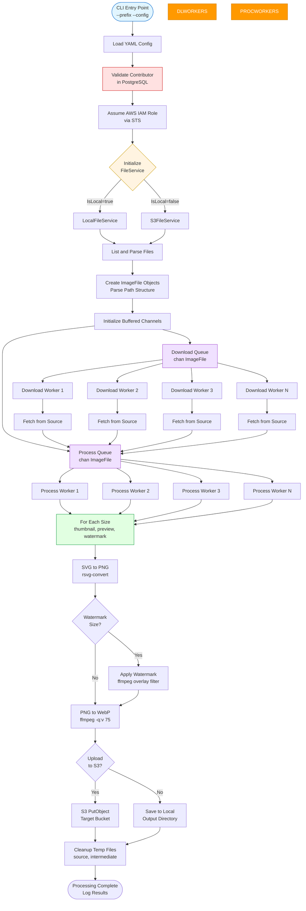

```mermaid
graph TB
    START([CLI Entry Point<br/>--prefix --config]) --> CONFIG[Load YAML Config]

    CONFIG --> VALIDATE[Validate Contributor<br/>in PostgreSQL]
    VALIDATE --> ROLE[Assume AWS IAM Role<br/>via STS]
    ROLE --> FILESERVICE{Initialize<br/>FileService}

    FILESERVICE -->|IsLocal=true| LOCAL[LocalFileService]
    FILESERVICE -->|IsLocal=false| S3FS[S3FileService]

    LOCAL --> LISTFILES[List and Parse Files]
    S3FS --> LISTFILES

    LISTFILES --> IMAGEFILES[Create ImageFile Objects<br/>Parse Path Structure]
    IMAGEFILES --> QUEUES[Initialize Buffered Channels]

    QUEUES --> DOWNLOADQ[Download Queue<br/>chan ImageFile]
    QUEUES --> PROCESSQ[Process Queue<br/>chan ImageFile]

    DOWNLOADQ --> DLW1[Download Worker 1]
    DOWNLOADQ --> DLW2[Download Worker 2]
    DOWNLOADQ --> DLW3[Download Worker 3]
    DOWNLOADQ --> DLWN[Download Worker N]

    DLW1 --> FETCH1[Fetch from Source]
    DLW2 --> FETCH2[Fetch from Source]
    DLW3 --> FETCH3[Fetch from Source]
    DLWN --> FETCHN[Fetch from Source]

    FETCH1 --> PROCESSQ
    FETCH2 --> PROCESSQ
    FETCH3 --> PROCESSQ
    FETCHN --> PROCESSQ

    PROCESSQ --> PW1[Process Worker 1]
    PROCESSQ --> PW2[Process Worker 2]
    PROCESSQ --> PW3[Process Worker 3]
    PROCESSQ --> PWN[Process Worker N]

    PW1 --> SIZES[For Each Size<br/>thumbnail, preview, watermark]
    PW2 --> SIZES
    PW3 --> SIZES
    PWN --> SIZES
    SIZES --> SVG2PNG[SVG to PNG<br/>rsvg-convert]

    SVG2PNG --> CHECKWM{Watermark<br/>Size?}
    CHECKWM -->|Yes| APPLYWM[Apply Watermark<br/>ffmpeg overlay filter]
    CHECKWM -->|No| PNG2WEBP[PNG to WebP<br/>ffmpeg -q:v 75]
    APPLYWM --> PNG2WEBP

    PNG2WEBP --> UPLOADCHECK{Upload<br/>to S3?}
    UPLOADCHECK -->|Yes| S3UPLOAD[S3 PutObject<br/>Target Bucket]
    UPLOADCHECK -->|No| LOCALSAVE[Save to Local<br/>Output Directory]

    S3UPLOAD --> CLEANUP[Cleanup Temp Files<br/>source, intermediate]
    LOCALSAVE --> CLEANUP

    CLEANUP --> DONE([Processing Complete<br/>Log Results])

    style START fill:#e1f5ff,stroke:#0066cc
    style FILESERVICE fill:#fff4e1,stroke:#cc9900
    style DOWNLOADQ fill:#f0e1ff,stroke:#9933cc
    style PROCESSQ fill:#f0e1ff,stroke:#9933cc
    style DLWORKERS fill:#FF9900,stroke:#cc7a00,color:#fff
    style PROCWORKERS fill:#FF9900,stroke:#cc7a00,color:#fff
    style SIZES fill:#e1ffe1,stroke:#009933
    style VALIDATE fill:#ffe1e1,stroke:#cc0000
```