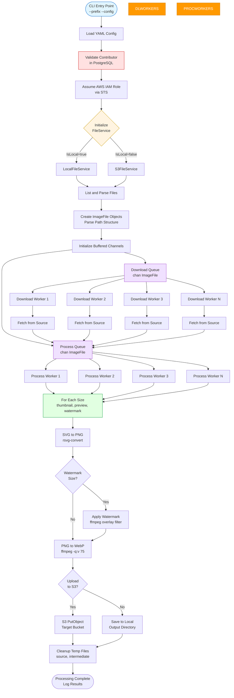

# High-Performance Batch Image Processor

A production-grade CLI tool built in Go to batch-convert 500,000+ SVG images to optimized WebP format at multiple sizes. Originally developed for [VectorIcons.com](https://vectoricons.com), a multi-vendor marketplace for vector illustrations and icons.

## The Problem

When VectorIcons launched, only PNG conversions were performed at upload time to save on development time. Later, we needed to generate multiple WebP versions retroactively for CDN delivery, previews, and browser compatibility across 500,000+ existing images.

Initial estimates using Node.js suggested 11.5 days of processing time. Go's concurrency model reduced this to **45 minutes** - a **16x performance improvement**.

---

## Technology Stack

- **Language:** Go 1.22 with goroutines and channels
- **Cloud:** AWS S3, AWS STS (IAM role assumption)
- **Database:** PostgreSQL with GORM
- **Image Processing:** rsvg-convert (SVG→PNG), ffmpeg (PNG→WebP, watermarking)
- **Configuration:** YAML-based with runtime validation

---

## Performance Results

### Single-Threaded Baseline

I first built a single-threaded version to establish a baseline, processing 4,500 test files:

| Metric | Value |
|--------|-------|
| Files processed | 4,500 files |
| Total time | 7 minutes 17 seconds |
| Throughput | **10.4 files/sec** |
| Extrapolated for 500K files | **13.4 hours** |

### Concurrent Implementation (10 Workers)

After adding Go's worker pool pattern with 10 concurrent goroutines:

| Metric | Value |
|--------|-------|
| Files processed | 4,500 files |
| Total time | 27 seconds |
| Throughput | **166.67 files/sec** |
| Extrapolated for 500K files | **50 minutes** |

### Language Comparison

| Language | Est. Time per Image | Total Runtime (500K files) | vs Go |
|----------|---------------------|----------------------------|-------|
| **Go** | ~1ms | **~45 minutes** | 1x |
| Python | ~50ms | ~41.6 hours | 55x slower |
| Node.js | ~200ms | ~11.5 days | 368x slower |

**Result:** Go's lightweight goroutines and native parallelism delivered a **16x improvement** over single-threaded execution.

---

## Architecture

The application follows a **producer-consumer pattern** with **dual worker pools**, using Go's concurrency primitives (goroutines, channels, and WaitGroups) to achieve high throughput.



---

## How It Works

### Dual Worker Pool Architecture

The processor uses two independent worker pools to parallelize I/O-bound (downloading) and CPU-bound (processing) operations:

1. **Download Workers** fetch files from source (S3 or local filesystem) and add them to the Process Queue
2. **Process Workers** pull from the queue and execute the image transformation pipeline
3. **Buffered Channels** connect the pools, enabling continuous processing without blocking

### Processing Pipeline

For each image, the processor generates multiple sizes (thumbnail: 128px, preview: 512px, watermark: 512px):

1. **SVG → PNG Conversion** using `rsvg-convert` at target dimensions
2. **Optional Watermarking** using ffmpeg's overlay filter for preview images
3. **PNG → WebP Conversion** using ffmpeg with quality optimization (`-q:v 75`)
4. **Upload** to S3 bucket or save to local output directory

### Concurrency Model

```go
// Buffered channels for work distribution
DownloadQueue := make(chan ImageFile, len(files))
ProcessQueue  := make(chan ImageFile, len(files))

// Configurable worker pools
for i := 0; i < downloadWorkers; i++ {
    go downloadWorker(DownloadQueue, ProcessQueue)
}
for i := 0; i < processWorkers; i++ {
    go processWorker(ProcessQueue)
}

// Synchronization with WaitGroups
downloadWG.Wait() // Wait for all downloads
close(ProcessQueue)
processWG.Wait()  // Wait for all processing
```

---

## Key Features

- **Highly Concurrent:** Configurable worker pools optimize for I/O and CPU workloads
- **Storage Flexibility:** Supports both local filesystem and AWS S3 (via strategy pattern)
- **Production-Ready:** Database validation, comprehensive logging, automatic cleanup
- **Config-Driven:** YAML configuration with sensible defaults
- **Hardware Acceleration:** Optional VideoToolbox support for ffmpeg on macOS
- **Modular Design:** Interface-based architecture with dependency injection

---

## Design Patterns

- **Producer-Consumer:** Decouples file discovery from processing via buffered channels
- **Strategy Pattern:** Abstract file service enables runtime switching between local/S3 backends
- **Worker Pool:** Limits concurrency to prevent resource exhaustion
- **Pipeline:** Sequential transformation stages (SVG → PNG → WebP) with conditional watermarking

---

## Installation & Usage

### Prerequisites

```bash
# macOS
brew install librsvg ffmpeg

# Ubuntu
sudo apt-get install librsvg2-bin ffmpeg
```

### Build

```bash
go build -o image-processor ./src/image-processor
```

### Configuration

Create a `config.yaml` file:

```yaml
aws_region: us-east-1
source_bucket: png-image-source-bucket
target_bucket: webp-output-target-bucket
role_arn: arn:aws:iam::111111111111:role/svg-webp-app-role

# Worker pool configuration
download_worker_pool_size: 5
process_worker_pool_size: 10

# Output sizes
webp_sizes:
  thumbnail: 128
  preview: 512
  watermark: 512

# Optional
watermark_path: /path/to/watermark.svg
use_hardware_acceleration: true
auto_cleanup: true
```

### Run

```bash
./image-processor --prefix=contributor-name --config=config.yaml
```

---

## Project Structure

```
go-batch-svg-to-webp/
├── src/
│   ├── image-processor/    # Main orchestrator & CLI
│   ├── file-service/       # Storage abstraction (Local/S3)
│   ├── image-file/         # Image metadata parser
│   ├── database/           # PostgreSQL integration
│   ├── models/             # GORM data models
│   └── common/             # Shared utilities
├── test/                   # Test fixtures
└── config-example.yml      # Configuration template
```

---

## License

MIT License. See LICENSE for details.

## Disclaimer

This software is provided "as is" without warranty of any kind. You are responsible for testing it in your environment and ensuring it meets your needs.
